`Axe`框架是一个开源的iOS业务组件化框架。本文介绍`Axe`框架的业务组件化思路，并介绍基于`Axe`框架，实现的组件动态化与开发管理平台化。

# 一、使用Axe框架实现业务组件化

业务组件化是近几年非常火的APP架构思路， 究其原因，随着业务发展，APP的规模也逐渐膨胀，代码管理与协作开发变得困难，编译耗时也屡创新高，应用功能的拆分与研发团队的拆分也不可避免。 这些发展需要APP架构的变更，以支持大型APP的开发，支持跨团队的协作。而解决方案就是将各个业务拆分成独立组件，从主工程中脱离，进行单独开发、编译、测试，不与其他业务组件相互耦合。

组件化方案，需要解决三个问题：

1. 代码隔离 ： 最基本的要求，使组件可以单独开发。
2. 单独编译 ： 组件单独构建编译，以提高APP编译速度，并为单独测试提供基础。
3. 组件交互 ： 满足组件之间交互的合理需求。

### 代码隔离

代码隔离比较容易实现，代码解耦，然后分离建仓，最后通过`Cocoapods`来管理引用。

### 单独编译

组件单独编译，构建成`Framework`静态库。

组件同时需要有源码版本，以进行调试。

组件的编译接入持续集成系统，一般会使用管理平台来管理组件的构建，下文中会提及。

### 组件交互

业务组件之间的沟通协调，是组件化中最关键的技术点， 一般的组件化方案，强调通过一种`协议机制`或者`target-action`的方式来实现。 而`Axe`中的组件交互，分为三个部分：

#### 数据

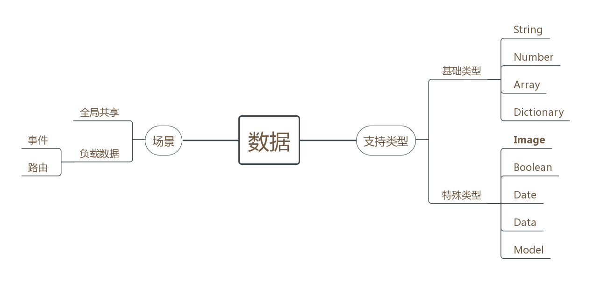

我们将数据抽离出来，作为组件交互的重要一环 ，组件间的数据交互分为两种：

1. 数据共享 ： 共享的是所有组件都可以获取的数据。
2. 数据传递 ： 数据也可以附着在路由和事件中传递。

单独的数据组件，是为了解决特殊类型数据的问题。 我们支持特殊数据类型，如**图片**、二进制数据、`Model`类型等。

#### 路由

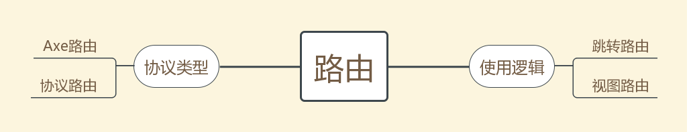

界面逻辑的处理交给路由。

根据路由的表现，我们定义两种路由：

* 跳转路由 ： 进行页面跳转，如使用`UINavigationController`的`push`，以打开一个新页面。
* 视图路由 ： 返回一个界面元素， 即返回一个`UIViewController`， 以满足嵌套页面的需求， 如 侧边栏、Tab栏等页面。

路由的表现形式是一个`URL`， 如同大多数的路由方案一样。默认支持的路由是`Axe`路由，结构为：

	axe://{moduleName}/{pageName}
	
如果`URL`附带参数，会自动转换为数据类型。路由支持回调处理。
 
 `Axe`的路由支持协议扩展，以实现自定义的路由处理。

#### 事件

使用事件监听机制，以实现更加灵活方便的跨组件交互。

在事件实现中，我们提供了方便好用的接口 ：`Axe`中的事件支持 同步、异步、优先级设定。 并且实现了两个特殊的功能：

1.组件初始化： 基于事件通知实现组件自注册。 通过事件中的优先级和同异步设定，来进行组件初始化的排序与管理。

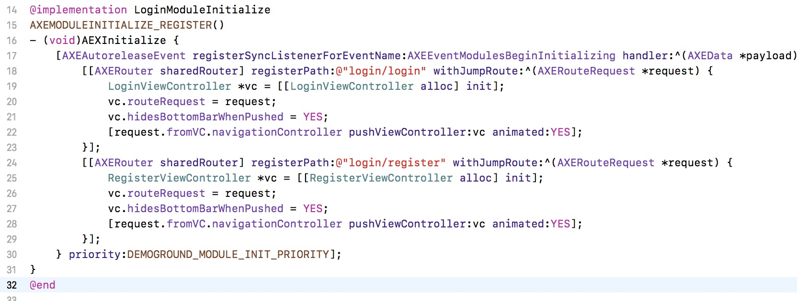

上图是简单的示例，进行登录组件的初始化，该部分代码放在登录组件内部。当接入登录组件时，就会在启动时自动初始化，以注册路由。

2.界面监听 ： 提供一种适用于界面展示的监听接口，该监听会保留回调，直到页面回到前台才执行；且同名的通知，不会出现重复处理，只会使用最新的数据执行一次。

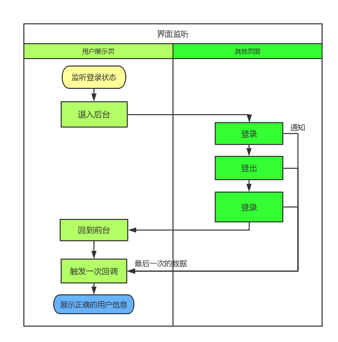

事件中可以附带数据。

### 总结

通过 `路由` 、 `事件`、 `监听` ， 我们为组件之间的交互提供了完善的支持。且实现了组件之间的代码完全无依赖。 组件交互时，只需要知道 调用的路由地址， 事件的名称，以及数据的键值与类型 （与`Model`数据的结构） ，只需要知道这些**声明**即可 （通过字符串的形式）。 一个声明文件的示例：

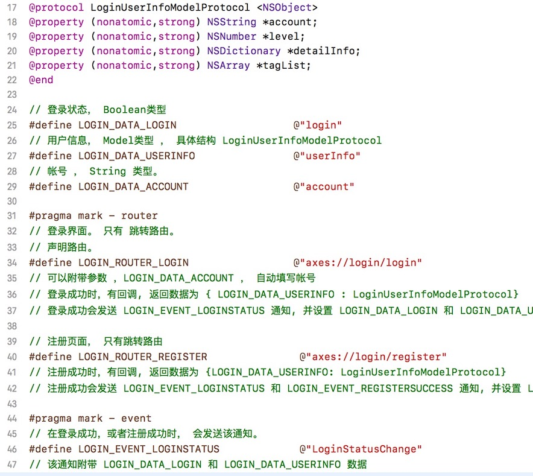

这也为后续支持其他容器的组件提供了基础。

# 二、基于Axe实现组件动态化

在APP动态化的需求下，使用`H5`和`React Native`成为很多`APP`的选择。 而我们也在`Axe`框架的基础上，再做优化，以更好的适应动态性的需求。

### 扩展容器

`Axe`不仅要支持`iOS`原生页面，也要支持`WebView`容器和`React Native`容器，使这两类业务组件也能够像原生一样，通过`Axe`接入组件化系统。

首先，通过协议扩展，在`Axe`上注册协议路由 ： `https` 和 `reacts` ， 使其他组件可以通过路由调用这些页面。扩展后，我们可以使用路由跳转到`H5`页面：

	[self jumpTo:@"https://demo.axe-org.cn/login-h5/#/"];

然后做`Native`与容器之间的桥接 ：在`WebView`上使用`WebViewJavascriptBridge`作为`JavaScript`的桥接，在`React Native`通过添加`Native Module`来做桥接 , 调用`Axe`来处理路由跳转、事件通知和数据请求。 路由与通知比较简单， 重点是数据， 我们通过特殊处理（标明类型和自动转换），以支持特殊类型的数据如`NSDate`、`NSData`、`UIImage`、`Model`等特殊类型，能在原生和`JavaScript`之间传递：

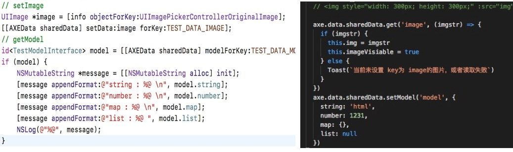

如上图代码所示，左侧是原生组件中的`OC`代码，右侧是扩展容器的`JavaScript`代码，`Axe`能够做到跨容器传递数据，甚至特殊类型，如图片、`Model`等。

通过桥接处理，目前我们使`WebView`和`React Native`容器接入了组件化，可以通过`Axe`调用其他组件，也可以通过`Axe`被其他组件调用， 使这两个容器在使用和表现上与原生组件**完全一样**！

### 离线包支持

为了更好地使用`JavaScript`的容器，`Axe`提供了一套简单的离线包方案。 离线包指 ： 将资源打包整合，统一管理下发，以使APP可以在离线的情况下，使用本地资源加载页面。

使用离线包，可以节约用户流量，提高页面加载速度，提高用户体验。 当前实现的简单离线包，使用`bsdiff`进行差分，支持上传到`oss`， 支持跟随`APP`打包，且拥有一个有趣的签名机制。

我们进行协议扩展 ：

* ophttp: 基于离线包的`H5`容器，路由URL形式是`ophttp://组件/页面`
* oprn : 基于离线包的`React-Native`容器，路由URL格式是 `oprn://组件/页面`

### 组件等同性

`Axe`中强调`组件等同性` , 即 如果两个组件实现了同样的**声明** , 拥有相同的业务逻辑 （被其他组件调用表现一致），那这两个组件，在`Axe`组件化体系中就可以视为 **相同的组件**， 就可以互相替换。

所以，在`Axe`组件化下，我们不关注组件的实现，只关注组件的业务逻辑， 只关注组件的声明文件，只关注组件提供的页面、事件和数据。组件等同性，使组件可以互相替换。在`Axe`组件化下替换组件的实现，不会影响其他业务组件的运行。

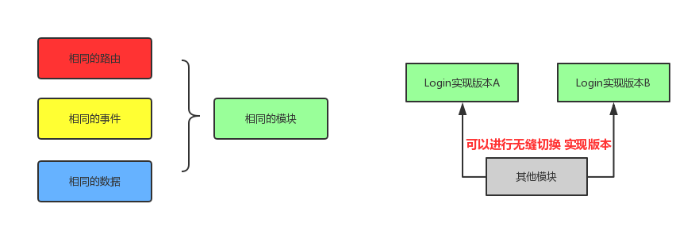

组件等同性，使我们可以为业务组件开发多个版本，使不同的用户使用不同的版本，以实现基于组件化方案的组件灰度测试。

### 动态路由

组件等同性 要求相同的路由，但是我们知道，传统的路由只能对应一个具体页面。

所以为了使用组件等同性，`Axe`提出一个`声明路由`的概念， `声明路由`是对`实现路由`的包装。使用动态路由后，组件的声明文件中标明的是`声明路由` 。所有业务组件通过声明路由来访问其他组件，而实际跳转时，再根据路由配置转换为`实现路由`。

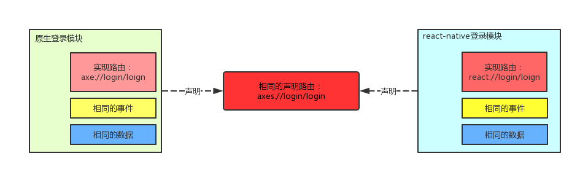

`Axe`提供了一个简单的动态路由服务， 通过这个服务管理和下发路由映射配置，使应用拥有线上动态切换组件实现的能力。

# 三、对组件开发进行平台化管理

基于`Axe`框架，我们实现了业务组件化， 组件动态化， 然后我们还要再进一步，实现组件管理平台化。

即通过一个平台，来规范组件化APP的开发、构建、测试、接入、发布流程，优化跨小组、团队、部门的协作开发，以做到协作开发的平台化。 平台化关注的问题有 ： 

### APP架构

在`Axe`组件化下，我们推荐将公共业务和基础组件合成一个组件，称之为`Ground`,地基组件，用于管理公共业务和公共的基础组件。

这样做的原因 ：

1. 统一管理基础内容的版本：业务组件开发时，只需要依赖`Ground`组件，而不需要过度关注具体基础组件的版本。
2. 将零散琐碎的基础组件统一起来，编译成一个整体，减少了组件数量， 一定程度上优化APP的整体架构。
3. 能够很好的处理基础组件中的`.a`和`.framework`静态库。

`Axe`通过脚本自动处理`Ground`项目中包含的子组件的头文件，使业务组件可以通过正常的头文件引入方式来使用基础组件。

### 代码管理

使用`gitlab` 。

对于版本，建立版本分支，如`version/0.0.1`，设置权限，确保所有提交都经过代码检视。

使用`git-lfs`管理 二进制文件。

### 项目管理

对于组件和APP的版本，我们要明确并记录项目的时间节点，严格按照计划执行项目。

控制组件版本的接入 ：组件的版本，必须经过APP管理人员的审核，才能接入APP中。

### 协作开发

组件的接口与更新日志要妥善的归档记录。

多组件协作开发时，需要提前设计好接口，以并发开发。设定好开发计划，以确保组件都能按时完成。最后合并在一起接入到APP中。

### 版本管理

组件版本号的管理，遵循语义化版本号，即使用 `主版本号.次版本号.修订号` 。然后，在使用`Cocoapods`进行组件版本的管理时，我们的处理方式是：

1. 指定 具体组件版本。
2. 只保留`Podfile` , 不上传`Podfile.lock`

在开发测试阶段，我们加入一个`beta`版本 ：通过先行版本，做开发版本的自动提升，以解决开发阶段的版本频繁变更的问题。 在完成开发测试后，构建`release`版本进行最终发布与封版：

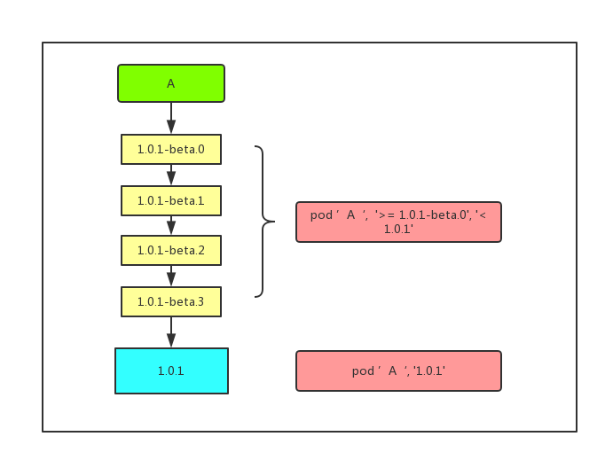

需要注意的是， `pod`依赖的编写，是使用工具自动处理，所以不用担心对开发阶段造成困惑。 

业务开发者只需要知道，在没有打`release`版本之前，可以随意的构建`beta`版本，而其他人使用时，也会自动的接入到最新的`beta`版本。

### 持续集成

使用`fastlane`和`Jenkins`做持续集成，`fastlane`编写脚本处理组件的管理、接入与打包。

### 自动化测试 

由于`Axe`组件化中，一个组件最重要的是其声明。 所以自动化测试的内容，就是按照声明调用接口， 然后检测返回值是否正确。 

在测试过程中一些重要节点进行截图，以快速检测UI问题。

> 自动化测试在0.1.0的`Axe`中并未实现。

### 组件开发管理平台

以上是`Axe`的解决方案的大致介绍。 同时`Axe` 提供了一个简单的组件化开发管理平台。该用来管理 ：

* 组件的开发计划
* 组件的文档
* 组件的构建 
* APP的开发计划
* 组件的接入和升级管理

当前`Demo`网址为[demo.axe-org.cn](https://demo.axe-org.cn) 。接下来我们简单介绍一下这套系统中的有趣或重要的地方：

#### 时间线

在`APP`版本或者组件版本开始前，先制定一个时间计划，指明APP版本或组件版本的重要时间节点 ：

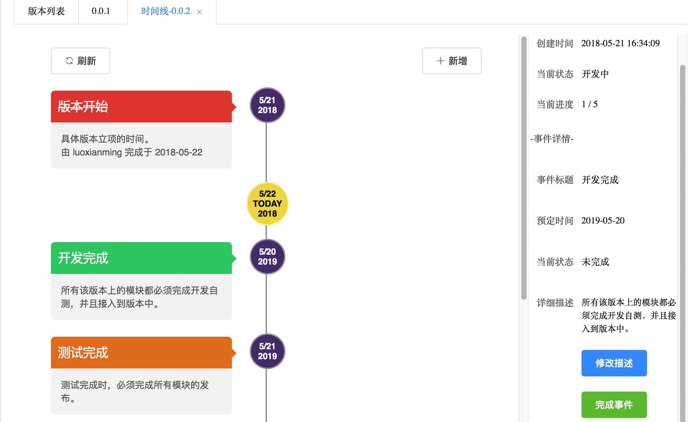

#### APP版本概览

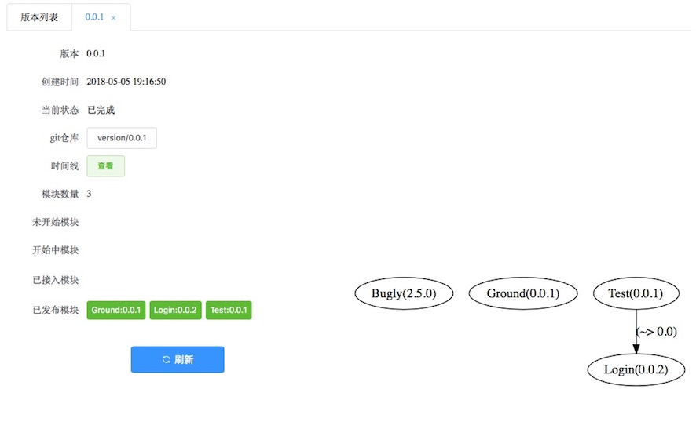

右侧是`APP`的依赖图，通过脚本自动绘制。

#### 组件概览

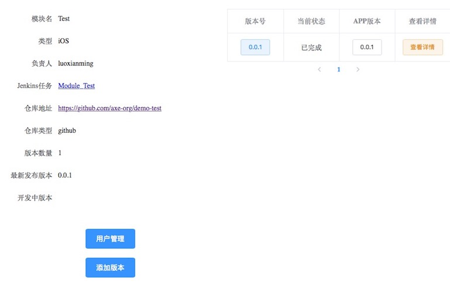

#### 组件版本概览

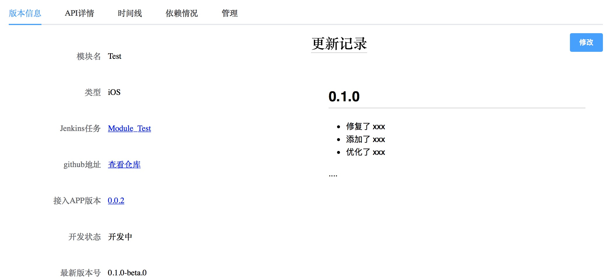

右侧记录版本的更新日志。

#### 组件API文档

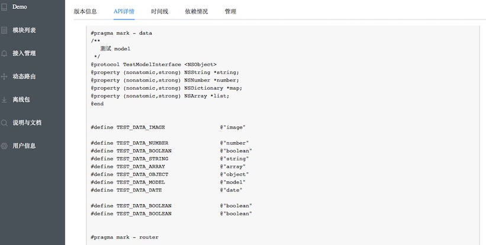

`API`文档，也就是上述的`声明文件`， 用于声明其支持的路由，暴露的数据和发送的通知。

#### 组件依赖情况

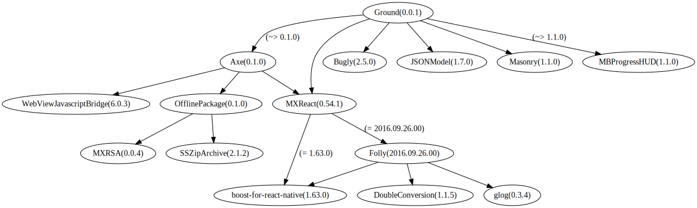

依赖图是脚本自动绘制的。

连线括号内是声明的版本限制，而圆圈括号内是具体使用的版本号。

#### 组件构建

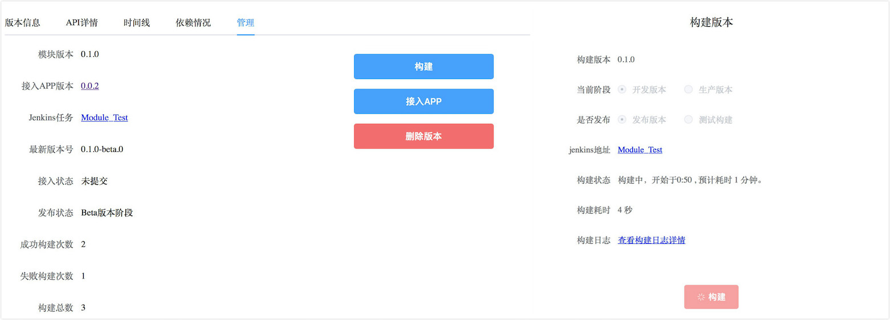

对接jenkins，调用组件构建任务，自动打包并提交版本。

#### 接入管理

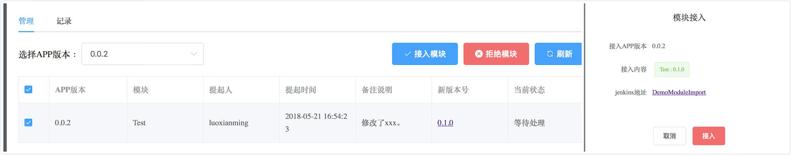

当一个业务组件开发完成后，需要提交接入APP的申请，由`APP`管理员查看并确认，才能接入该版本。

# 总结

基于`Axe`框架，我们实现iOS应用的业务组件化，并在此基础上，进行动态化的扩展，最后更进一步，实现平台化的管理。目前项目开源在github, 地址为[axe-org/axe](https://github.com/axe-org/axe)，我们会持续维护与更新，欢迎大家来体验、抓虫与吐槽。

