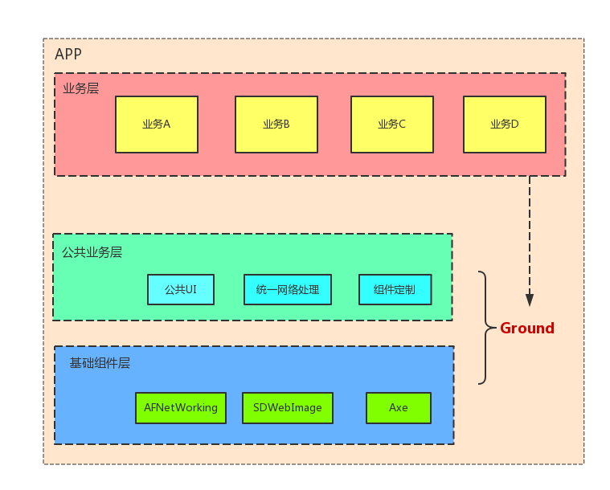

## 组件开发管理平台

[demo示例](https://demo.axe-org.cn)

## 安装

使用`docker`发布与安装，详细安装与配置见

[axe-admin-docker](https://github.com/axe-org/axe-admin-docker)

## 使用

我们的组件管理借助工具`fastlane`。我们将这个APP分为三个部分：

* APP : APP的一些基础内容的定制，和管理组件的版本。
* Ground: 基础组件和公共业务的集合。
* Module : 业务组件，也就是我们讨论的主要内容。

则对于APP来说，整体架构如下图所示 ：

### 文件结构

对于使用了我们辅助工具的项目，在根目录下，创建两个文件夹：

* fastlane: 放的是`Fastfile` ，其中引入我们的工具: 

		import_from_git(url: 'https://github.com/axe-org/fastlane', branch: 'v0.2')

* axe : 存放`Axe`的配置文件，以及构建产生的中间结果。

`axe`文件夹中的配置文件有 ：

#### Axefile.rb

Axe的管理文件，由于`fastlane`和`CocoaPods`都是使用`ruby`，所以我们这里也参考两者的写法，使用`ruby` 。 其中配置项有 ：

* type : 类型， 分为三种`app`, `ground`, `module`。
* name : 组件名称 ， `app`类型没有组件名。
* workspace ： 使用`CocoaPods`，所以这里标明一下`workspace`的相对路径。一般业务组件将项目文件放在根目录下，所以为`Module.xcworkspace`
* scheme : 组件打包的`scheme`, 这里使用正常的target即可，打包脚本自动打一份真机一份模拟器，然后合并。
* version : 组件版本号。 注意 版本升级时，一定要修改这里的版本号。
* header : 声明文件路径。 
* pod_repo : 私有Cocoapods repo名称。 开发时需要有自己的私有仓库.
* dependency : 依赖。 这个是业务组件需要配置，以声明业务组件之间的依赖关系。

#### 业务组件之间的依赖关系

业务组件之间的依赖，决定于API的版本，所以前面章节中，我们强调对组件版本的约束。

这里的依赖，我们遵守语义化版本规则 ， 以下做一示例说明：

1. 一开始， A 和B两个组件都是0.0.1版本， A 依赖B， 则我们在dependency上的设定为 ：

		s.dependency = { :B => '0.0.1' }

	实际上，在`Podfile`或者`Podspec`上标明的依赖形式为 ：
	
		pod 'B' , '~> 0.0'

	按照语义化版本，只要B没有发生不兼容的API变更，则A的版本都是可以与B兼容的。
	
2. 所以，当`B` 修复了一个BUG，或者做了一个优化，由`0.0.1`版本升到`0.0.10` 。 而A模块并不关注B的实现，只要接口没变，A模块不需要做变更。
3. 当`B`模块添加了一些API，版本号由`0.0.10` 升到`0.1.1` : 当A模块不需要使用时，也不要做任何变更。
4. 当 `B`模块添加了一些API，版本号由`0.1.1` 升到`0.2.1` : 而A模块当时需要使用这些新功能，所以A模块需要重新打包，也需要修改自己的依赖，将依赖更新为： 

		 s.dependency = { :B => '0.2.1' }

5. 当 `B`模块做了不兼容的API变更，版本号由 `0.2.1`升到`1.0.1`时，则不论A模块本来这个APP版本是否有开发任务，都需要打包一个新的版本来兼容B的新版本。 即由于B的不兼容版本的变更，会导致所有依赖B的业务组件都需要发布一个新版本进行兼容，将依赖更新为 ：

		s.dependency = { :B => '1.0.1' }
		
这也说明了我们前面对版本控制的严格要求的原因， 我们要避免这种不兼容的API变更，即使是在公司内部。

#### Podfile.rb 和 Module.podspec.rb

这两个文件辅助文件，根目录中的`Podfile`和`podspec`文件，是由`axe`文件夹中这两个文件修改得到的。 所以要修改配置时，需要修改这两个文件。

#### 脚手架

为了快速搭建一个标准的`module`的结构，我们在工具中提供了`axe_init_module`命令，在创建了`Fastfile`文件后，执行命令：

	fastlane axe_init_module
	
就可以快速搭建一个标准的`module`结构。

对于`App`和`Ground`类型，暂时参考`demo`项目。

## 使用组件开发管理平台

目前来说，界面还算能看，使用起来没有太大的问题。 如果您有意见，欢迎来`github`吐槽。

